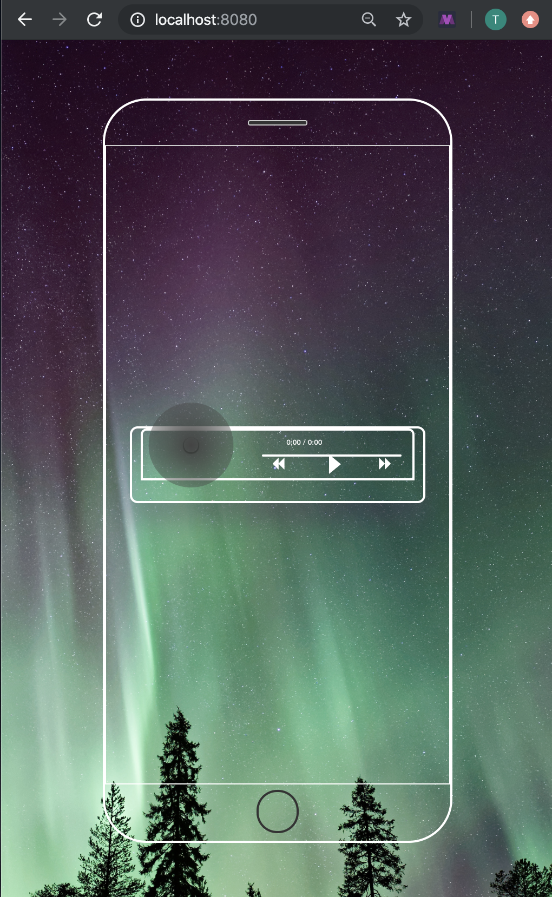
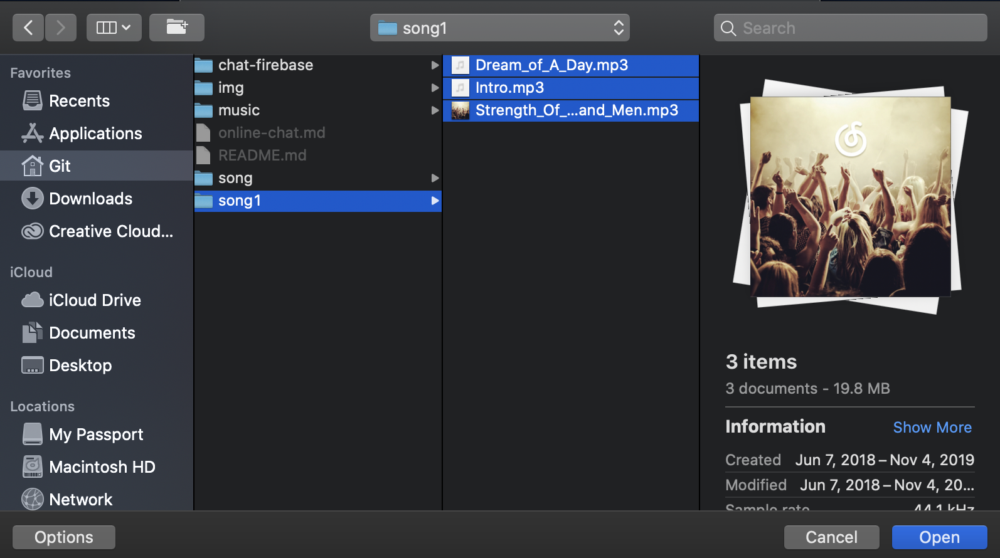
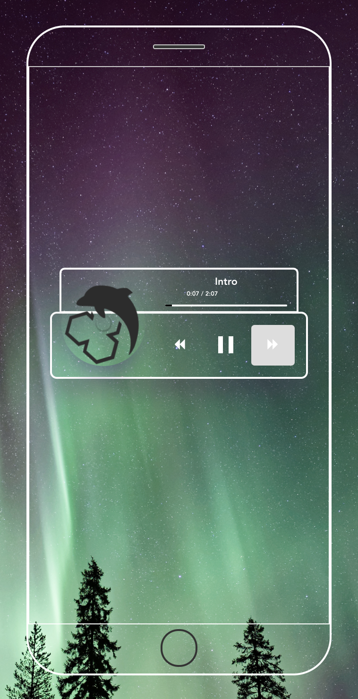
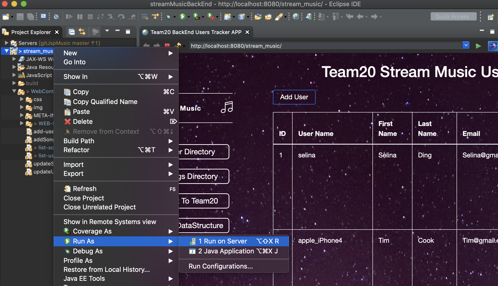

# Stream-Music
use PHP + Mysql, Vue.js for Front-end; Jsp+Servlert JDBC for Back-end; use Vue.js to build a mp3 player

- including a Chat room by creating a web app; this web depends on Firebase API
- A MP3 player by using Vue.js
- user can browse all albums
- user can play any songs 
- `$pw = sha1($pw)`, sha1 encrypt algorithm to protect password
---

## Welcome HomePage
- register

- create a account
- insert data into MySQL database

-
- then user can browser all albums, which read from my database
-
- click an album

- click `play` button to listern this song
  1. play
  2. pause
  3. skip to next song
  4. loop
  5. turn to previous song
  6. adjusting volume

## Mp3 player (Vuejs)
- click `User Defined`
- you can play any songs you downloaded
- can change the source code to increasing the size of songs array

- click `disk` icon

- click open
- click play icon

- including 
    1. play
    2. pause
    3. skip
    4. previous
---

## Back-End (Jsp-Serve Jsp + Servlert JDBC)
- open Eclipse

- input `http://localhost:8080/stream_music/`
- this is back-end website backstage database
- user info CRUD
- songs info CRUD

## you also can chat to me (using Firebase API)
- click `Chat to Team20`

- or input `https://novemberfall.github.io/musicChat/`

- you can talk to me

Thank you for reading.

